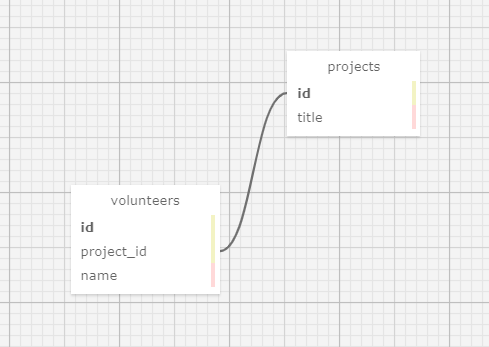

# Volunteer & Project Tracker
#### **Author: Mekinsie Callahan**
* * *
## Description
This application allows an employee to track projects and the volunteers working on them.

Interact with the application directly: https://ancient-cove-73372.herokuapp.com/
## Technologies used

* HTML
* Bootstrap
* git
* Ruby
* Embedded Ruby (ERB)
* RSpec
* Sinatra
* Capybara
* Bundler
* Heroku
* Bundler

* * *
## User Stories

* As a non-profit employee, I want to view, add, update and delete projects.
* As a non-profit employee, I want to view and add volunteers.
* As a non-profit employee, I want to add volunteers to a project.

* * *
## Schema



* * *
## Software Requirements
* **Ruby or Docker is required to run this application**
* **PostgreSQL is required to run the database**  

 <a href="https://www.learnhowtoprogram.com/ruby-and-rails/getting-started-with-ruby/installing-ruby">Ruby download instructions</a>  
 <a href="https://www.learnhowtoprogram.com/ruby-and-rails/docker-with-ruby/installing-docker">Docker download instructions</a>  
  <a href="https://www.learnhowtoprogram.com/ruby-and-rails/getting-started-with-ruby/installing-postgres">PosgreSQL download instructions</a>  

## Installation Instructions
1. Navigate to the desired directory where you would like to clone the project to.

2. Once you have chosen your desired directory, clone the github repo using the version control tool `git` (<a href="https://www.learnhowtoprogram.com/introduction-to-programming/getting-started-with-intro-to-programming/git-and-github">download instructions</a>). Typing the following command into your terminal:
```bash
$ git clone https://github.com/mekinsie/volunteers
```
3. Open the project in VSCode by typing the following in your terminal:

``` bash
$ code .
```
* Note: VSCode is a code editing software. If you don't already have it, you can download it <a href="https://code.visualstudio.com/">here</a>

**If you are using Docker, skip steps 4 & 5.**

4. While located in the root directy, install gem bundler by typing:

``` bash
$ gem install bundler
```

5. Install gem bundles by typing:

``` bash
$ bundle
```
6. To recreate the database used in this project, type the following into your terminal:
```
$ createdb volunteer_tracker
$ psql volunteer_tracker < database_backup.sql
$ createdb -T volunteer_tracker volunteer_tracker_test
```
7. Start a local server in your browser by typing the following into the terminal:
```
$ ruby app.rb
```
8. In your default browser, type "localhost:4567" into the search bar and press enter. Here, you will see the live server.

## Running Tests
* This application was created using test-driven development (TDD).
* To run the tests yourself, follow the steps below.

**Run tests using Ruby (no Docker):**
If you have Ruby already installed, simply type "rspec" into your terminal while located in the root directory of the project.
``` bash
$ rspec
```

**Run tests using Docker:**

To use Docker, you will first need to [install](https://docs.docker.com/get-docker/) it. Once it's installed, Docker should be open so you can actually run Docker commands in the terminal.

We recommend creating an alias for the following commands. The alias should look something like this:

```
dspec ()
{
  docker-compose down
  docker-compose up --build
  docker-compose run --rm app
}
```
<a href="https://www.learnhowtoprogram.com/ruby-and-rails/docker-with-ruby/using-aliases">Instructions on how to create an Alias</a>  
With this alias, the `dspec` command will automatically run RSpec tests. If you prefer not to use an alias, simply type each of the aforementioned commands into your terminal.

* * *

## License
> [GPLv3](https://choosealicense.com/licenses/gpl-3.0/)\
> Mekinsie Callahan &copy; 2021

* * *

## Contact Information

Reach me via <a href="https://www.linkedin.com/in/mekinsie/" target="_blank">Linkedin</a> or <a href="mailto:mekinsie.aja@gmail.com" target="_blank">email</a></li>.